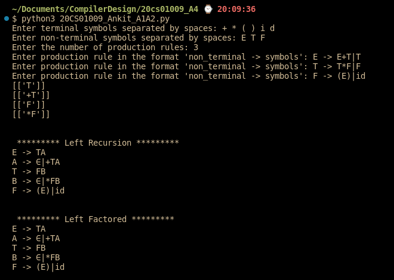
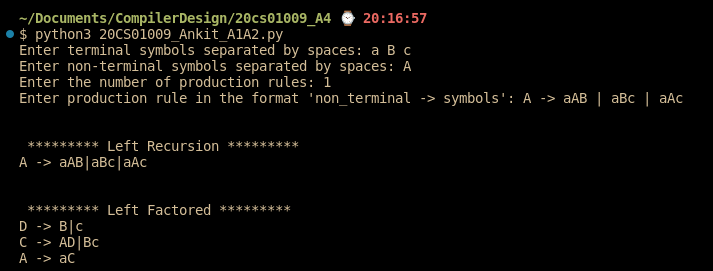
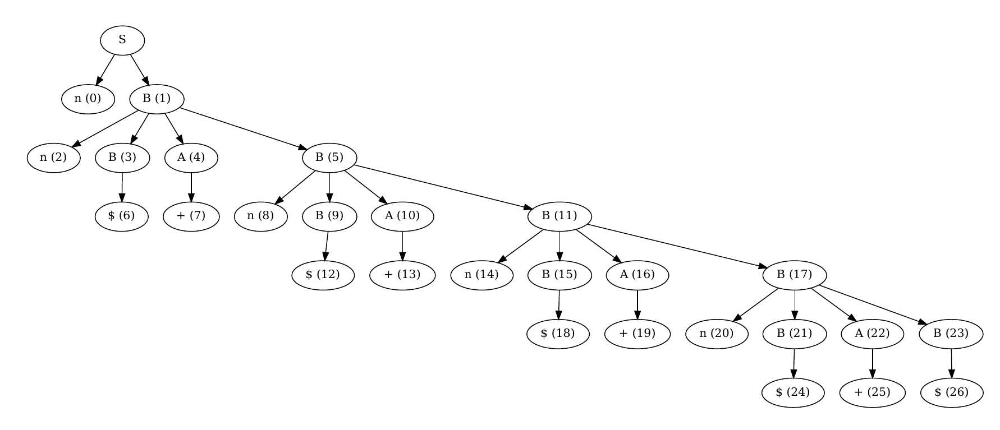
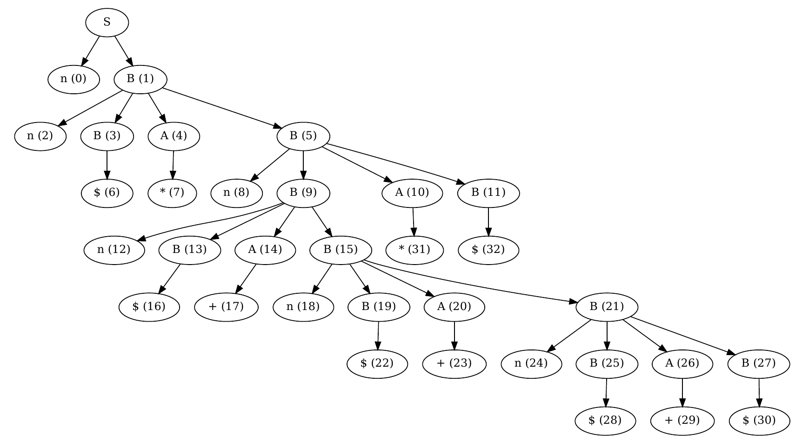

# Assignment 4 
Ankit Patel (20CS01009)


### REMOVE LEFT RECURSION
1. Direct Left Recursion
  ```html
    if we have a Rule in which there is direct Left Recursion like the below example
      A → Aα | β

    We change that Rule to a Right Recursion by using the below transformation
      A → βA’
      A’ → αA’ | ∈
  ```

2. Indirect Left Recursion
  ```html
    if we have a Rules in which there is Indirect Left Recursion like the below example
      A → Bb
      B → Ca | ∈
      C → A | ∈
    because A → Bb → Cab → Aab 

    Inorder to Eliminate it we apply a DFS from each nonTerminal which moves to the first nonTerminal if any across a production rule 
    which is A → B as B is a first character which is nonTerminal in A's rule

    Using this DFS if check if cycle exist then a Indirect left Recursion exists

    To remove it we take starting nonTerminal which A here replace its nonTerminal along the cycle by their production Rules

    Step 1 :A → Bb
    Step 2 :A → Cab | B

    then replace this A's production in C's

    Final : C → Cab | ∈

    Final Production Rules 
      A → Bb
      B → Ca | ∈
      C → Cab | ∈

    then we remove its direct left Recursion

  ```
3. Repeatedly apply the above two algorithm until the state of production rules doesn't change which will remove the left Recursion form the rules 


### Left Factoring

1. Algorithm
```html
  If RHS of more than one production starts with the same symbol, then such a grammar is called as Grammar With Common Prefixes
    A → αβ1 | αβ2 | αβ3
  
  using the Transformation given below we can remove left Factoring
    A → aA' 
    A → β1 | β2 | β3

```

2. We apply the above algortihm Repeatedly until the state of production rule doesn't change

### Section 3 Parser

``` C
void A() {
  Choose an A-production, A→ X1 X2 Xki for (i = 1 to k ) {
  if (X, is a nonterminal )
    call procedure Xi();
    else if (X, equals the current input symbol a) advance the input to the next symbol;
    else /* an error has occurred */;
  }
}
```

### How to Run

1. python3 -m venv .env
2. pip instatl -r requirement.txt
3. python3 <fileName>


## TEST

### Question 1 (A)
INPUT
```txt
 E -> E+T|T
 T -> T*F|F
 F -> (E)|id
```
OUTPUT


### Question 2
INPUT
```txt
A -> aAB | aBc | aAc
```
OUTPUT



### Question 2
INPUT
```txt
    nn+n+n+n+   //pass
    nn*nn+n+n+  //fail
    nn*nn+n+n+* //pass
    nn+n        //fail
```
OUTPUT
1. nn+n+n+n+


2. nn*nn+n+n+*


